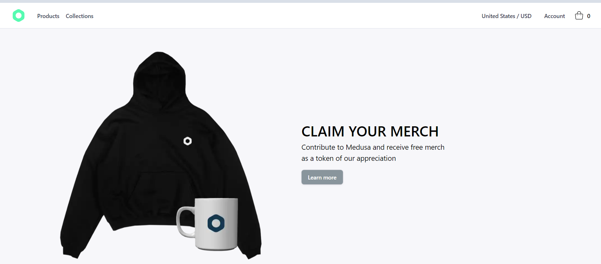
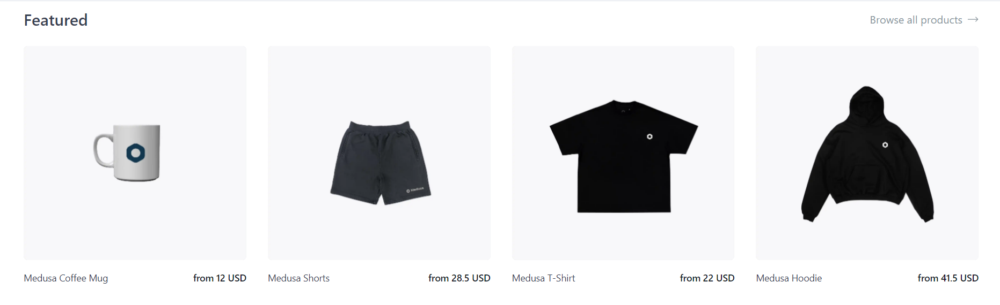

# Medusa Remix


## About

### Participants
Gokul K S - [Github](https://github.com/Gokul-Ks "@Gokul K S")

### Description

Starter Medusa StoreFront project built using Remix + Tailwind CSS.





## Setup

### Prerequisites

You'll at least need to setup and run a [Medusa server](https://github.com/medusajs/medusa) before running this storefront project:

```sh
# Install Medusa CLI
npm install -g @medusajs/medusa-cli

# Initialize a new commerce store populated with data
medusa new my-medusa-store --seed

# Launch Medusa server in dev mode
medusa develop
```

Running the above commands will have you running a complete commerce engine locally in just a few minutes. Do note the engine is headless and that you'll need [Medusa-Admin](https://github.com/medusajs/admin) for adminstration dashboard.

### Development

From your terminal:

```sh
# Install package dependencies
npm install

# Run storefront in dev mode
npm run dev
```

This starts your app in development mode, rebuilding assets on file changes.

### Deployment

First, build your app for production:

```sh
npm run build
```

Then run the app in production mode:

```sh
npm start
```

Now you'll need to pick a host to deploy it to.


## Resources
- [Medusa’s GitHub repository](https://github.com/medusajs/medusa)
- [Medusa Documentation](https://docs.medusajs.com/)
